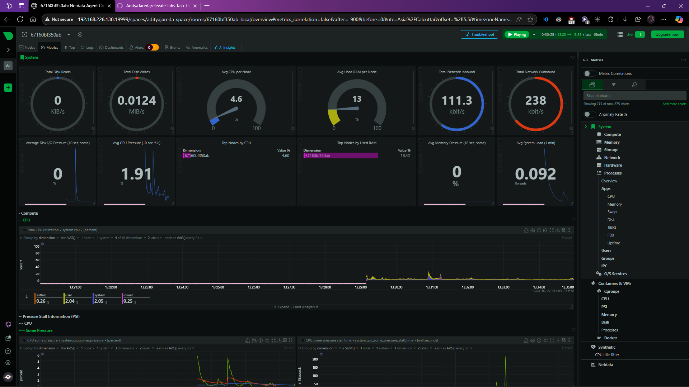
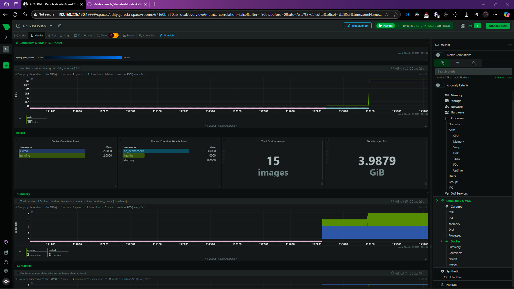

# Day 7: Real-Time System Monitoring with Netdata

For today's task, I moved from deploying applications to observing them. After all, if you can't see what your system is doing, you can't know if it's healthy. This project was my introduction to the world of real-time monitoring using Netdata.

The goal was to set up a comprehensive monitoring dashboard that could give me instant, high-fidelity insights into my server's performance and any applications running on it.

## Why Netdata?

While there are many monitoring tools out there like Prometheus and Grafana, I chose Netdata for this task because it's incredibly powerful for single-node monitoring. Its biggest strengths are:

*   **Auto-discovery:** It automatically detects hundreds of services and system metrics right out of the box with zero configuration.
*   **High-Resolution, Real-Time Data:** It collects metrics every second and displays them on the dashboard instantly, which is perfect for troubleshooting live issues.
*   **Ease of Setup:** As you'll see below, I was able to get a professional-grade dashboard running with a single Docker command.

## My Setup: Running Netdata in Docker

I decided to run Netdata as a Docker container, as it keeps my host system clean. To get the most out of it, I couldn't just run a basic container; I needed to give it secure, read-only access to parts of my host's kernel and Docker environment.

This is the command I used to launch the container:

```bash
# This command starts Netdata in the background, but with some extra permissions.
docker run -d --name=netdata \
  # I'm mapping the dashboard port to my host.
  -p 19999:19999 \
  # These next two lines give Netdata read-only access to my host's process and system info.
  -v /proc:/host/proc:ro \
  -v /sys:/host/sys:ro \
  # This is the key for monitoring other containers: I'm sharing the Docker socket.
  -v /var/run/docker.sock:/var/run/docker.sock:ro \
  # I'm adding a specific Linux capability instead of using the insecure '--privileged' flag.
  --cap-add SYS_PTRACE \
  --security-opt apparmor=unconfined \
  # Finally, telling it which image to use.
  netdata/netdata
```

## The Live Dashboard: My System's "Instrument Panel"
The screenshot below is the final result. It's a live view of my Ubuntu VM's performance.

1. System Overview:



2. Docker Containers Overview:


